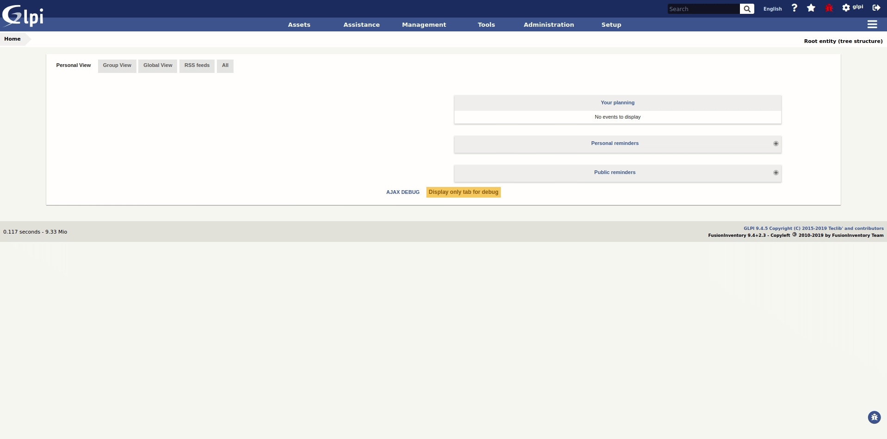

# Genericobject ITSMNG plugin

The genericobject plugin allows to extends ITSMNG to manage new types of objects.

## Documentation

We maintain a detailed documentation here -> [Documentation](http://glpi-plugins.readthedocs.io/en/latest/genericobject/index.html)

## Contributing

* Work on a new branch on your own fork
* Open a PR that will be reviewed by a developer

## Copying

* **Code**: you can redistribute it and/or modify
